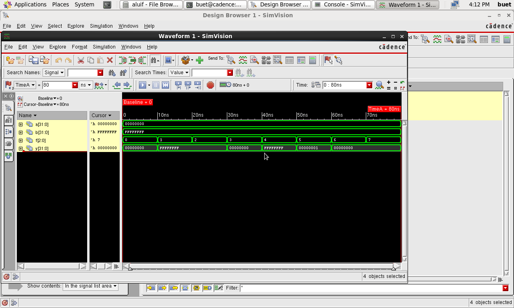

# 32-bit ALU (if-else version): RTL Design and Simulation (Verilog)

A 32-bit ALU written in Verilog using if-else behavioral modeling, with 4 logical and 4 arithmetic operations. Simulated with Cadence NC-Verilog, with waveforms viewed in Cadence SimVision.

A case-based version of the same ALU is in a separate repository: https://github.com/varunparameshwarappa18-lgtm/32bit-alu_case-verilog

## Design
`alu_if` takes two 32-bit operands `a` and `b` and a 3-bit select `f`, and drives a 32-bit result `y` from a combinational `always @(*)` block using an if-else chain.

| f | Operation |
|---|-----------|
| 000 | AND (`a & b`) |
| 001 | OR (`a \| b`) |
| 010 | XOR (`a ^ b`) |
| 011 | XNOR (`~(a ^ b)`) |
| 100 | Add (`a + b`) |
| 101 | Subtract (`a - b`) |
| 110 | Multiply (`a * b`) |
| 111 | Divide (`a / b`) |

## Testbench
`alu_if_tb` holds `a = 0x00000000` and `b = 0xFFFFFFFF` and steps `f` through all 8 opcodes at 10 ns intervals.

| f | Operation | Expected y |
|---|-----------|------------|
| 000 | AND | 00000000 |
| 001 | OR | FFFFFFFF |
| 010 | XOR | FFFFFFFF |
| 011 | XNOR | 00000000 |
| 100 | Add | FFFFFFFF |
| 101 | Subtract | 00000001 (0 - 0xFFFFFFFF wraps around) |
| 110 | Multiply | 00000000 |
| 111 | Divide | 00000000 |

## Result
The SimVision waveform shows `y` matching the expected value for each opcode.

## Files
- `rtl/alu_if.v`: design (`alu_if`)
- `tb/alu_if_tb.v`: testbench (`alu_if_tb`)
- `32bit-alu_if.png`: SimVision waveform

## Tools
Verilog, Cadence NC-Verilog, Cadence SimVision

## Limitations and next steps
- All cases use the same operands (`a = 0`), so several operations give identical results and cannot be told apart. Tests with non-trivial operands are the next step.
- Division by zero (`b = 0`) is not tested.
- Checking is done by inspecting waveforms. A self-checking testbench with expected-value comparison is the next improvement.
